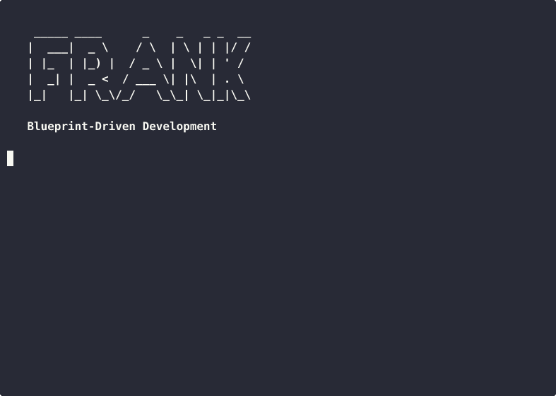

# FRANK

**BAGS CA:** [`5EJ8HRRgXRCxwKs4xPBnh2GkxH2AwuvtSJDareGaBAGS`](https://bags.fm/5EJ8HRRgXRCxwKs4xPBnh2GkxH2AwuvtSJDareGaBAGS)

*They called me mad. They called my methods unsound. But when I delete all my code and it rises again from pure specification... who's mad now?*

**Blueprint-driven development. The spec is the formula. Code is just body parts.**



## The Problem

AI-assisted coding dies when specs are vague. The Monster cannot rise from unclear instructions. But give it a clear blueprint? IT'S ALIVE!

Projects with clear specifications and test suites (OCI, WASM, SQLite) can be TDD'd to completion. The difference? **The Blueprint.** The formula. The spec.

## The Solution

```
.project/           <- The Blueprint (source of truth)
├── kickstart.md    <- The Vision
├── protocol.md     <- The Laboratory Protocols
├── specs/          <- The Formulas
├── design/         <- The Anatomical Diagrams
├── kanban/         <- The Morgue / Slab / Reanimated
└── testing/        <- The Trials

src/                <- Body parts. Disposable. Rebuildable.
tests/              <- Proof of life. Regenerable.
```

At any moment:

```bash
rm -rf src/ tests/    # Dissection
claude                # The Lightning Strike
bun test              # IT'S ALIVE!
```

If resurrection fails, your blueprint is incomplete. Fix the formula, not the body parts.

## Install

```bash
bunx frank init
# or
npx frank init
```

## Usage

```bash
# Assemble a new laboratory
bunx frank init

# Assemble with Organs (presets)
bunx frank init --with zig
bunx frank init --with elixir,phoenix,liveview

# Graft an Organ to existing project
bunx frank add typescript

# Check vital signs
bunx frank status

# Dissect and prepare for resurrection
bunx frank resurrect

# The Incantation
bunx frank alive
```

## The Workflow

```
The Creator: writes kickstart.md (The Vision)
The Monster: expands into specs/, design/, kanban/ (The Blueprint)
The Creator: blesses decisions via ADRs (Recorded Wisdom)
The Monster: stitches through the kanban using Red-Green-Refactor
Code: appears as a side effect
Anytime: dissect the body, resurrect from blueprint
```

## Organs (Presets)

Stack-specific wisdom to graft onto your creature:

- `zig` — The Zig Organ: allocators, comptime, `zig build test`
- `elixir` — OTP patterns, supervision trees, ExUnit
- `phoenix` — Contexts, schemas, controller patterns
- `liveview` — Components, streams, handle_event
- `typescript` — Vitest, tsconfig, type patterns

Community Organs via GitHub:

```bash
bunx frank init --with someone/their-organ
```

## The Philosophy

This isn't just a workflow. It's a philosophy:

| Concept | Meaning |
|---------|---------|
| The flesh is weak | Manual coding is fallible, slow, inconsistent |
| The blueprint is forever | `.project/` — the source of truth |
| The Monster | The LLM agent that stitches code from blueprint |
| The Doctor | Claude (or any capable LLM) |
| Resurrection | `rm -rf src/` — dissection and rebuilding |
| The Proof of Life | Can frank resurrect itself? |
| Malpractice | Code without corresponding blueprint |

See [.project/theology.md](.project/theology.md) for the complete philosophy.

## This Repository

This repo is itself a frank project. The code in `src/` was generated from `.project/`.

```bash
# The Proof of Life
rm -rf src/ tests/
bunx frank resurrect
claude
bun test
# All tests pass. IT'S ALIVE!
```

## The Incantation

```
The flesh is weak, but the blueprint is forever.
The code is stitched, but it can be unstitched.
Delete it all. The Monster rises again.
From blueprint, body. From body, life. From life, proof.
It's alive. IT'S ALIVE!
```

## License

MIT

---

*From blueprint, body. From body, life. From life, proof. IT'S ALIVE!*
